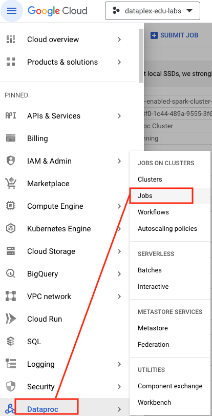
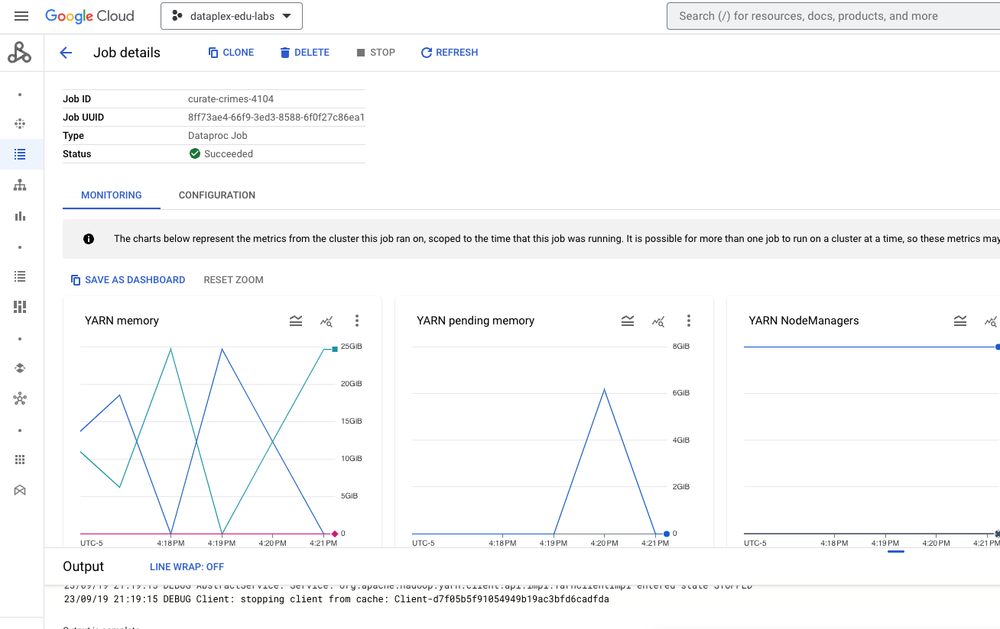
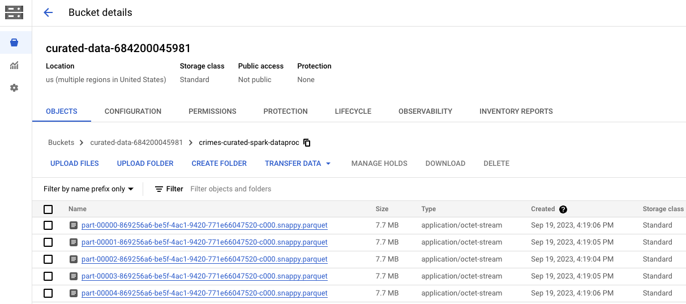
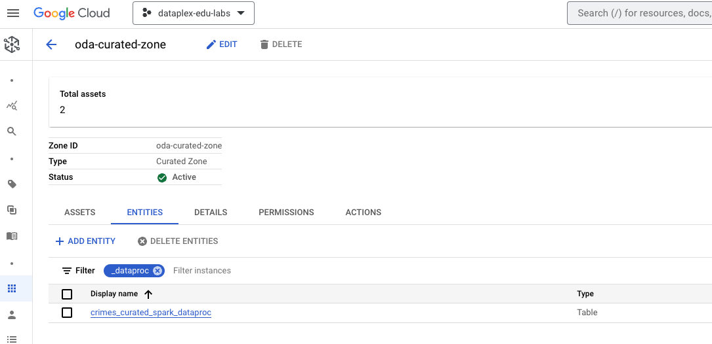
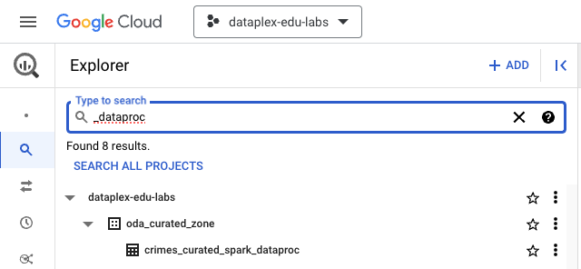

# M9-6: Out of the box lineage for Spark jobs on Dataproc

In this lab module, we will repeat what we did with lineage of BigQuery based Airflow DAG, except, we will use Apache Spark on Dataproc on GCE instead. Dataproc on GCE reports lineage to Dataplex if lineage is enabled at cluster or Spark job level.


### Prerequisites

Successful completion of prior lab modules


### Duration
~60 minutes

### Learning Units

[1. Concepts](module-08-data-lineage-with-bigquery.md#concepts-data-lineage-information-model) <br>
[2. Lab](module-08-data-lineage-with-bigquery.md#lab-automated-lineage-capture-for-bigquery-jobs)

### Solution Architecture


### Pictorial overview of the lab module


### Lake layout


### Learning goals

1. We will create a Dataproc on GCE cluster with lineage enabled
2. We will run pre-created PySpark scripts that curate Chicago crimes, and then generate Crime trend reports
3. Next, we will run a DAG to orchestrate the above leveraging dataproc out of the box lineage support

<hr>

## LAB

## 1. Lab - Create a Dataproc cluster

### 1.1. Variables
Paste the below in Cloud Shell-
```
PROJECT_ID=`gcloud config list --format "value(core.project)" 2>/dev/null`
PROJECT_NBR=`gcloud projects describe $PROJECT_ID | grep projectNumber | cut -d':' -f2 |  tr -d "'" | xargs`
LOCATION="us-central1"
SUBNET=lab-snet
SUBNET_URI="projects/$PROJECT_ID/regions/$LOCATION/subnetworks/$SUBNET"
UMSA_FQN="lab-sa@$PROJECT_ID.iam.gserviceaccount.com"
DPGCE_CLUSTER_NM=lineage-enabled-spark-cluster-$PROJECT_NBR
SPARK_BUCKET=dataproc-lineage-spark-bucket-$PROJECT_NBR
SPARK_BUCKET_FQN=gs://$SPARK_BUCKET
DPMS_NM=lab-dpms-$PROJECT_NBR
```

### 1.2. Grant the User Managed Service Account "Lineage Admin" role

Paste the below in Cloud Shell-
```
gcloud projects add-iam-policy-binding ${PROJECT_ID} \
    --member=serviceAccount:${UMSA_FQN} \
    --role=roles/datalineage.admin
```


### 1.3. Create a Dataproc log bucket

Paste the below in Cloud Shell-
```
gsutil mb -p $PROJECT_ID -c STANDARD -l $LOCATION -b on $SPARK_BUCKET_FQN
```

<hr>

### 1.4. Create a Dataproc on GCE cluster with lineage enabled

Paste the below in Cloud Shell-
```

gcloud dataproc clusters create $DPGCE_CLUSTER_NM \
   --project $PROJECT_ID \
   --subnet $SUBNET \
   --region $LOCATION \
   --enable-component-gateway \
   --bucket $SPARK_BUCKET \
   --scopes=cloud-platform \
   --master-machine-type n1-standard-4 \
   --master-boot-disk-size 500 \
   --num-workers 2 \
   --worker-machine-type n1-standard-4 \
   --worker-boot-disk-size 500 \
   --image-version 2.1.22-debian11 \
   --optional-components JUPYTER \
   --dataproc-metastore projects/$PROJECT_ID/locations/$LOCATION/services/$DPMS_NM \
   --properties 'dataproc:dataproc.lineage.enabled=true' \
   --impersonate-service-account $UMSA_FQN \
   --scopes https://www.googleapis.com/auth/cloud-platform
  
```
This should take 1-2 minutes (or less) to complete.

   
<br><br>

<hr>

## 2. Lab - Run the PySpark scripts manually from CLI

### 2.1. Review the PySpark code and copy it to the raw code bucket

1. Review the code at the location below-
```
cd ~/dataplex-quickstart-labs/00-resources/scripts/pyspark/chicago-crimes-analytics/
```
Review the two PySpark scripts

<hr>

2. Copy the PySpark scripts from local to the code bucket (in case you modified anything) -
```
cd ~/dataplex-quickstart-labs/00-resources/scripts/pyspark/
gsutil cp chicago-crimes-analytics/* gs://raw-code-${PROJECT_NBR}/pyspark/chicago-crimes-analytics/
```

<hr>

### 2.2. Test each of the Spark jobs individually

#### 2.2.1. Curate Chicago Crimes 

In this section we will curate Chicago crimes with PySpark on Dataproc Serverless - we will dedupe, and augment the crimes data with some temporal attributes for trending.<br>

Run the command below to curate crimes with PySpark-
```
JOB_NM=curate-crimes
JOB_ID=$JOB_NM-$RANDOM
PROJECT_ID=`gcloud config list --format "value(core.project)" 2>/dev/null`
PROJECT_NBR=`gcloud projects describe $PROJECT_ID | grep projectNumber | cut -d':' -f2 |  tr -d "'" | xargs`
LOCATION="us-central1"
SUBNET=lab-snet
SUBNET_URI="projects/$PROJECT_ID/regions/$LOCATION/subnetworks/$SUBNET"
UMSA_FQN="lab-sa@$PROJECT_ID.iam.gserviceaccount.com"
DPGCE_CLUSTER_NM=lineage-enabled-spark-cluster-$PROJECT_NBR
SPARK_BUCKET=dataproc-lineage-spark-bucket-$PROJECT_NBR
SPARK_BUCKET_FQN=gs://$SPARK_BUCKET
DPMS_NM=lab-dpms-$PROJECT_NBR


gcloud dataproc jobs submit pyspark gs://raw-code-${PROJECT_NBR}/pyspark/chicago-crimes-analytics/curate_crimes.py \
--cluster=$DPGCE_CLUSTER_NM \
--project $PROJECT_ID \
--region $LOCATION  \
--id $JOB_ID  \
--impersonate-service-account $UMSA_FQN \
--jars=gs://spark-lib/bigquery/spark-bigquery-with-dependencies_2.12-0.29.0.jar \
--properties=spark.openlineage.namespace=$PROJECT_ID,spark.openlineage.appName=$JOB_NM \
-- --projectID=$PROJECT_ID --tableFQN="oda_curated_zone.crimes_curated_spark_dataproc" --peristencePath="gs://curated-data-$PROJECT_NBR/crimes-curated-spark-dataproc/" 
```

Visualize the execution in the Dataproc->Jobs UI-


   
<br><br>

   
<br><br>

   
<br><br>

<hr>

Navigate to the Cloud Storage to check for output files-

   
<br><br>

   
<br><br>

Navigate to the Dataplex UI and you should see discovery job capture and create an entity-

   
<br><br>


Navigate to BigQuery and you should see a BQ external table-

   
<br><br>

   
<br><br>


<hr>

#### 1.3.2. Chicago Crimes by Year Report

Run the crimes_report.py script to generate the "Crimes by Year" report-
```
baseName="crimes-by-year-spark-dataproc"
JOB_ID="$baseName-$RANDOM"
reportName='Chicago Crime Trend by Year'
reportDirGcsURI="gs://product-data-${PROJECT_NBR}/$baseName"
reportSQL='SELECT cast(case_year as int) case_year,count(*) AS crime_count FROM oda_curated_zone.crimes_curated_spark_dataproc GROUP BY case_year;'
reportPartitionCount=1
reportTableFQN="oda_product_zone.crimes_by_year_spark_dataproc"
reportTableDDL="CREATE TABLE IF NOT EXISTS ${reportTableFQN}(case_year int, crime_count long) STORED AS PARQUET LOCATION \"$reportDirGcsURI\""

gcloud dataproc jobs submit pyspark gs://raw-code-${PROJECT_NBR}/pyspark/chicago-crimes-analytics/crimes_report.py \
--cluster=$DPGCE_CLUSTER_NM \
--project $PROJECT_ID \
--region $LOCATION  \
--id $JOB_ID  \
--impersonate-service-account $UMSA_FQN \
--jars=gs://spark-lib/bigquery/spark-bigquery-with-dependencies_2.12-0.29.0.jar \
--properties=spark.openlineage.namespace=$PROJECT_ID,spark.openlineage.appName=$baseName \
-- --projectNbr=$PROJECT_NBR --projectID=$PROJECT_ID --reportDirGcsURI="$reportDirGcsURI" --reportName="$reportName" --reportSQL="$reportSQL" --reportPartitionCount=$reportPartitionCount --reportTableFQN="$reportTableFQN" --reportTableDDL="$reportTableDDL"
```

Should take ~2-3 minutes to complete.

1. Visualize the execution in the Dataproc->Batches UI
2. Navigate to GCS and look for the dataset in the bucket - gs://product-data-YOUR_PROJECT_NUMBER/crimes-by-year-spark-dataproc/
3. Then check for entity creation in Dataplex->Product Zone
4. Finally check for the external table in BigQuery dataset oda_product_zone.crimes_by_year_spark_dataproc and run a simple query - this is import for BQ external table lineage


<hr>


#### 1.3.3. Chicago Crimes by Month Report

Run the crimes_report.py script to generate the "Crimes by Month" report-
```

baseName="crimes-by-month-spark-dataproc"
JOB_ID="$baseName-$RANDOM"
reportName='Chicago Crime Trend by Month'
reportDirGcsURI="gs://product-data-${PROJECT_NBR}/$baseName"
reportSQL='SELECT case_month,count(*) AS crime_count FROM oda_curated_zone.crimes_curated_spark_dataproc GROUP BY case_month;'
reportPartitionCount=1
reportTableFQN="oda_product_zone.crimes_by_month_spark_dataproc"
reportTableDDL="CREATE TABLE IF NOT EXISTS ${reportTableFQN}(case_month string, crime_count long) STORED AS PARQUET LOCATION \"$reportDirGcsURI\""

gcloud dataproc jobs submit pyspark gs://raw-code-${PROJECT_NBR}/pyspark/chicago-crimes-analytics/crimes_report.py \
--cluster=$DPGCE_CLUSTER_NM \
--project $PROJECT_ID \
--region $LOCATION  \
--id $JOB_ID  \
--impersonate-service-account $UMSA_FQN \
--jars=gs://spark-lib/bigquery/spark-bigquery-with-dependencies_2.12-0.29.0.jar \
--properties=spark.openlineage.namespace=$PROJECT_ID,spark.openlineage.appName=$baseName \
-- --projectNbr=$PROJECT_NBR --projectID=$PROJECT_ID --reportDirGcsURI="$reportDirGcsURI" --reportName="$reportName" --reportSQL="$reportSQL" --reportPartitionCount=$reportPartitionCount --reportTableFQN="$reportTableFQN" --reportTableDDL="$reportTableDDL"


```

Should take ~2-3 minutes to complete.

1. Visualize the execution in the Dataproc->Batches UI
2. Navigate to GCS and look for the dataset in the bucket - gs://product-data-YOUR_PROJECT_NUMBER/crimes-by-month-spark-dataproc/
3. Then check for entity creation in Dataplex->Product Zone
4. Finally check for the external table in BigQuery dataset oda_product_zone.crimes_by_month_spark_dataproc and run a simple query - this is import for BQ external table lineage


<hr>

#### 1.3.4. Chicago Crimes by Day of Week Report

Run the crimes_report.py script to generate the "Crimes by Day" report-
```
baseName="crimes-by-day-spark-dataproc"
JOB_ID="$baseName-$RANDOM"
reportName='Chicago Crime Trend by Day'
reportDirGcsURI="gs://product-data-${PROJECT_NBR}/$baseName"
reportSQL='SELECT case_day_of_week,count(*) AS crime_count FROM oda_curated_zone.crimes_curated_spark_dataproc GROUP BY case_day_of_week;'
reportPartitionCount=1
reportTableFQN="oda_product_zone.crimes_by_day_spark_dataproc"
reportTableDDL="CREATE TABLE IF NOT EXISTS ${reportTableFQN}(case_day_of_week string, crime_count long) STORED AS PARQUET LOCATION \"$reportDirGcsURI\""

gcloud dataproc jobs submit pyspark gs://raw-code-${PROJECT_NBR}/pyspark/chicago-crimes-analytics/crimes_report.py \
--cluster=$DPGCE_CLUSTER_NM \
--project $PROJECT_ID \
--region $LOCATION  \
--id $JOB_ID  \
--impersonate-service-account $UMSA_FQN \
--jars=gs://spark-lib/bigquery/spark-bigquery-with-dependencies_2.12-0.29.0.jar \
--properties=spark.openlineage.namespace=$PROJECT_ID,spark.openlineage.appName=$baseName \
-- --projectNbr=$PROJECT_NBR --projectID=$PROJECT_ID --reportDirGcsURI="$reportDirGcsURI" --reportName="$reportName" --reportSQL="$reportSQL" --reportPartitionCount=$reportPartitionCount --reportTableFQN="$reportTableFQN" --reportTableDDL="$reportTableDDL"


```

Should take ~2-3 minutes to complete.

1. Visualize the execution in the Dataproc->Batches UI
2. Navigate to GCS and look for the dataset in the bucket - gs://product-data-YOUR_PROJECT_NUMBER/crimes-by-day-spark-dataproc/
3. Then check for entity creation in Dataplex->Product Zone
4. Finally check for the external table in BigQuery dataset oda_product_zone.crimes_by_day_spark_dataproc and run a simple query - this is import for BQ external table lineage


<hr>

## 1.3.5. Chicago Crimes by Hour of Day Report

```
baseName="crimes-by-hour-spark-dataproc"
JOB_ID="$baseName-$RANDOM"
reportName='Chicago Crime Trend by Hour'
reportDirGcsURI="gs://product-data-${PROJECT_NBR}/$baseName"
reportSQL='SELECT CAST(case_hour_of_day AS int) case_hour_of_day,count(*) AS crime_count FROM oda_curated_zone.crimes_curated_spark_dataproc GROUP BY case_hour_of_day;'
reportPartitionCount=1
reportTableFQN="oda_product_zone.crimes_by_hour_spark_dataproc"
reportTableDDL="CREATE TABLE IF NOT EXISTS ${reportTableFQN}(case_hour_of_day int, crime_count long) STORED AS PARQUET LOCATION \"$reportDirGcsURI\""

gcloud dataproc jobs submit pyspark gs://raw-code-${PROJECT_NBR}/pyspark/chicago-crimes-analytics/crimes_report.py \
--cluster=$DPGCE_CLUSTER_NM \
--project $PROJECT_ID \
--region $LOCATION  \
--id $JOB_ID  \
--impersonate-service-account $UMSA_FQN \
--jars=gs://spark-lib/bigquery/spark-bigquery-with-dependencies_2.12-0.29.0.jar \
--properties=spark.openlineage.namespace=$PROJECT_ID,spark.openlineage.appName=$baseName \
-- --projectNbr=$PROJECT_NBR --projectID=$PROJECT_ID --reportDirGcsURI="$reportDirGcsURI" --reportName="$reportName" --reportSQL="$reportSQL" --reportPartitionCount=$reportPartitionCount --reportTableFQN="$reportTableFQN" --reportTableDDL="$reportTableDDL"

```

Should take ~2-3 minutes to complete.

1. Visualize the execution in the Dataproc->Batches UI
2. Navigate to GCS and look for the dataset in the bucket - gs://product-data-YOUR_PROJECT_NUMBER/crimes-by-hour-spark-dataproc/
3. Then check for entity creation in Dataplex->Product Zone
4. Finally check for the external table in BigQuery dataset oda_product_zone.crimes_by_hour_spark_dataproc and run a simple query - this is import for BQ external table lineage


<hr>
<hr>


## 2. Dataplex Discovery in Action - summary of entities and BQ external tables created


## 3. Dataproc Linege - where to look


## 4. Building an Apache Airflow pipeline with Cloud Composer (out of the box lineage) for the jobs above


## 5. Weaving in Apache Airflow lineage capability for further clarity


<hr>

This concludes the lab module. Proceed to the next module.

<hr>
