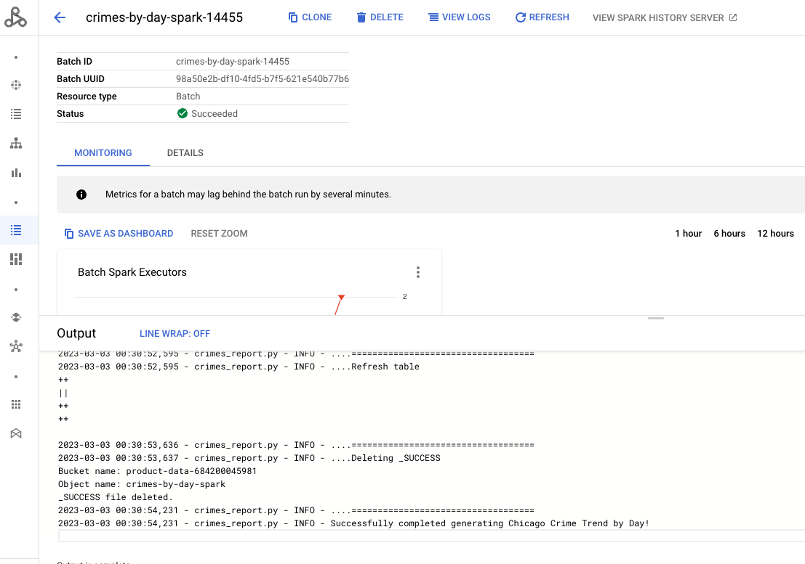
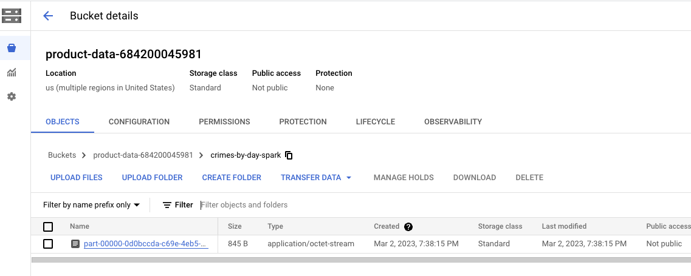
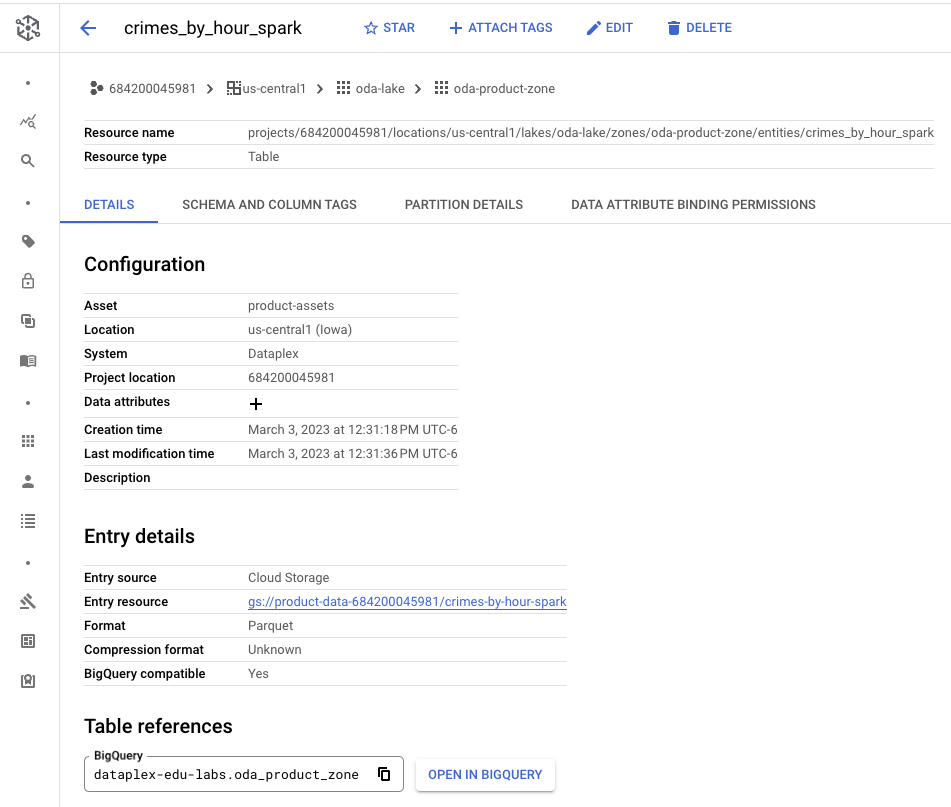
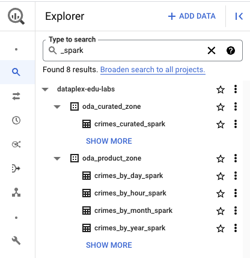
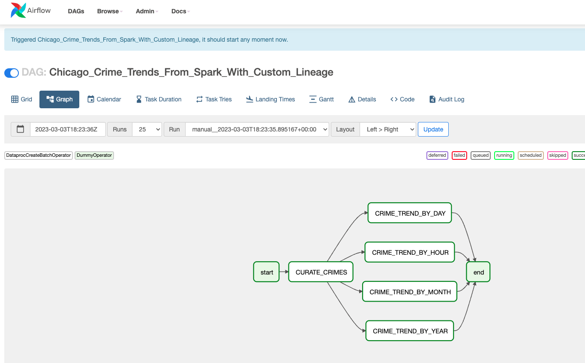
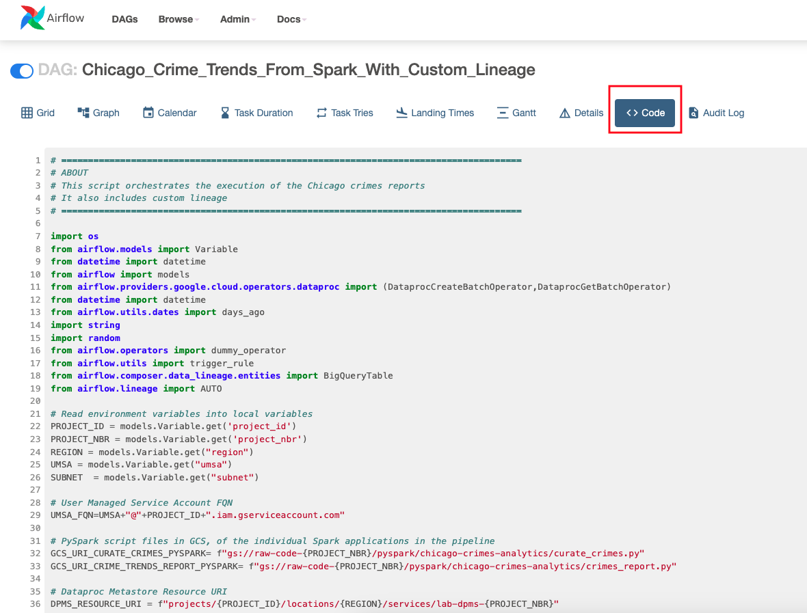
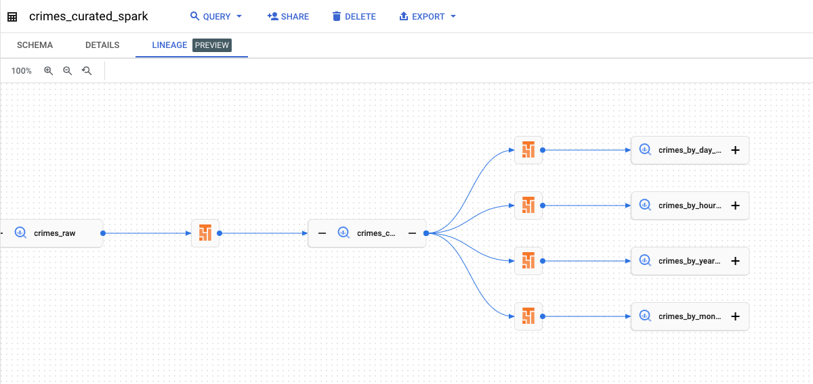
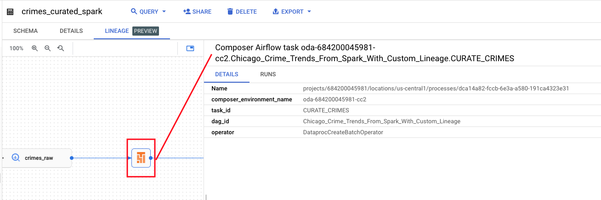
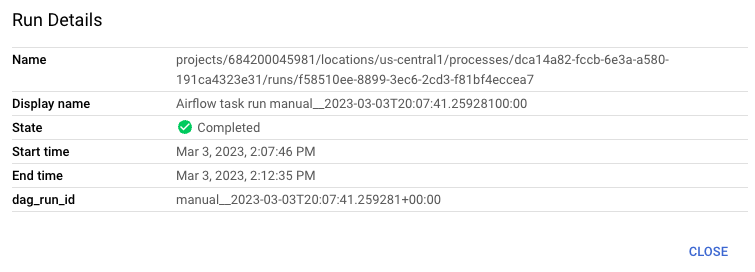

# M9-6: Out of the box lineage for Spark jobs on Dataproc

In this lab module, we will repeat what we did with lineage of BigQuery based Airflow DAG, except, we will use Apache Spark on Dataproc on GCE instead. 


### Prerequisites

Successful completion of prior lab modules


### Duration
~60 minutes

### Learning Units

[1. Concepts](module-08-data-lineage-with-bigquery.md#concepts-data-lineage-information-model) <br>
[2. Lab](module-08-data-lineage-with-bigquery.md#lab-automated-lineage-capture-for-bigquery-jobs)

### Solution Architecture


### Pictorial overview of the lab module


### Lake layout


### Learning goals

1. We will create a Dataproc on GCE cluster with lineage enabled
2. We will run pre-created PySpark scripts that curate Chicago crimes, and then generate Crime trend reports
3. Next, we will run a DAG to orchestrate the above leveraging dataproc out of the box lineage support

<hr>

## LAB

## 1. Lab - Create a Dataproc cluster

### 1.1. Variables
Paste the below in Cloud Shell-
```
PROJECT_ID=`gcloud config list --format "value(core.project)" 2>/dev/null`
PROJECT_NBR=`gcloud projects describe $PROJECT_ID | grep projectNumber | cut -d':' -f2 |  tr -d "'" | xargs`
LOCATION="us-central1"
SUBNET=lab-snet
SUBNET_URI="projects/$PROJECT_ID/regions/$LOCATION/subnetworks/$SUBNET"
UMSA_FQN="lab-sa@$PROJECT_ID.iam.gserviceaccount.com"
DPGCE_CLUSTER_NM=lineage-enabled-spark-cluster-$PROJECT_NBR
SPARK_BUCKET=dataproc-lineage-spark-bucket-$PROJECT_NBR
SPARK_BUCKET_FQN=gs://$SPARK_BUCKET
DPMS_NM=lab-dpms-$PROJECT_NBR
```

### 1.2. Create a Dataproc log bucket

Paste the below in Cloud Shell-
```
gsutil mb -p $PROJECT_ID -c STANDARD -l $LOCATION -b on $SPARK_BUCKET_FQN
```

<hr>

### 1.3. Create a Dataproc on GCE cluster with lineage enabled

Paste the below in Cloud Shell-
```

gcloud dataproc clusters create $DPGCE_CLUSTER_NM \
   --service-account=$UMSA_FQN \
   --project $PROJECT_ID \
   --subnet $SUBNET \
   --region $LOCATION \
   --enable-component-gateway \
   --bucket $SPARK_BUCKET \
   --scopes=cloud-platform \
   --master-machine-type n1-standard-4 \
   --master-boot-disk-size 500 \
   --num-workers 2 \
   --worker-machine-type n1-standard-4 \
   --worker-boot-disk-size 500 \
   --image-version 2.1.22-debian11 \
   --optional-components JUPYTER \
   --dataproc-metastore projects/$PROJECT_ID/locations/$LOCATION/services/$DPMS_NM \
   --properties 'dataproc:dataproc.lineage.enabled=true' \
   --initialization-actions gs://dataproc-lineage/init-action/lineage_util.sh \
   --scopes https://www.googleapis.com/auth/cloud-platform
  
```

### 1.4. Grant the User Managed Service Account "Lineage Admin" role

Paste the below in Cloud Shell-
```
gcloud projects add-iam-policy-binding ${PROJECT_ID} \
    --member=serviceAccount:${UMSA_FQN} \
    --role=roles/datalineage.admin
```

<hr>

## 2. Lab - Run the PySpark scripts manually from CLI

### 2.1. Review the PySpark code and copy it to the raw code bucket

1. Review the code at the location below-
```
cd ~/dataplex-quickstart-labs/00-resources/scripts/pyspark/chicago-crimes-analytics/
```
Review the two PySpark scripts

<hr>

2. Copy the PySpark scripts from local to the code bucket (in case you modified anything) -
```
cd ~/dataplex-quickstart-labs/00-resources/scripts/pyspark/
gsutil cp chicago-crimes-analytics/* gs://raw-code-${PROJECT_NBR}/pyspark/chicago-crimes-analytics/
```

<hr>

### 2.2. Test each of the Spark jobs individually

#### 2.2.1. Curate Chicago Crimes 

In this section we will curate Chicago crimes with PySpark on Dataproc Serverless - we will dedupe, and augment the crimes data with some temporal attributes for trending.<br>

Run the command below to curate crimes with PySpark-
```
JOB_ID=chicago-crimes-curate-$RANDOM

gcloud dataproc jobs submit pyspark gs://raw-code-${PROJECT_NBR}/pyspark/chicago-crimes-analytics/curate_crimes.py \
--cluster=$DPGCE_CLUSTER_NM \
--project $PROJECT_ID \
--region $LOCATION  \
--id $JOB_ID  \
--impersonate-service-account $UMSA_FQN \
--jars=gs://dataproc-lineage/jars/openlineage-spark-0.18.0.jar,gs://spark-lib/bigquery/spark-bigquery-with-dependencies_2.12-0.29.0.jar \
--properties=spark.openlineage.transport.type=datacatalog,spark.openlineage.namespace=$PROJECT_ID,spark.openlineage.appName=$JOB_ID \
-- --projectID=$PROJECT_ID --tableFQN="oda_curated_zone.crimes_curated_spark_dataproc" --peristencePath="gs://curated-data-$PROJECT_NBR/crimes-curated-spark-dataproc/" 
```

Visualize the execution in the Dataproc->Jobs UI-


<hr>

Navigate to the Cloud Storage to check for output files-


<hr>

#### 1.3.2. Chicago Crimes by Year Report

Run the crimes_report.py script to generate the "Crimes by Year" report-
```
baseName="crimes-by-year-spark-dataproc"
JOB_ID="$baseName-$RANDOM"
reportName='Chicago Crime Trend by Year'
reportDirGcsURI="gs://product-data-${PROJECT_NBR}/$baseName"
reportSQL='SELECT cast(case_year as int) case_year,count(*) AS crime_count FROM oda_curated_zone.crimes_curated_spark_dataproc GROUP BY case_year;'
reportPartitionCount=1
reportTableFQN="oda_product_zone.crimes_by_year_spark_dataproc"
reportTableDDL="CREATE TABLE IF NOT EXISTS ${reportTableFQN}(case_year int, crime_count long) STORED AS PARQUET LOCATION \"$reportDirGcsURI\""

gcloud dataproc jobs submit pyspark gs://raw-code-${PROJECT_NBR}/pyspark/chicago-crimes-analytics/crimes_report.py \
--cluster=$DPGCE_CLUSTER_NM \
--project $PROJECT_ID \
--region $LOCATION  \
--id $JOB_ID  \
--impersonate-service-account $UMSA_FQN \
--jars=gs://dataproc-lineage/jars/openlineage-spark-0.18.0.jar,gs://spark-lib/bigquery/spark-bigquery-with-dependencies_2.12-0.29.0.jar \
--properties=spark.openlineage.transport.type=datacatalog,spark.openlineage.namespace=$PROJECT_ID,spark.openlineage.appName=$JOB_ID \
-- --projectNbr=$PROJECT_NBR --projectID=$PROJECT_ID --reportDirGcsURI="$reportDirGcsURI" --reportName="$reportName" --reportSQL="$reportSQL" --reportPartitionCount=$reportPartitionCount --reportTableFQN="$reportTableFQN" --reportTableDDL="$reportTableDDL"

```

Visualize the execution in the Dataproc->Batches UI-


<hr>


<hr>

Navigate to the Cloud Storage to check for output files-


<hr>


#### 1.3.3. Chicago Crimes by Month Report

Run the crimes_report.py script to generate the "Crimes by Month" report-
```

baseName="crimes-by-month-spark-dataproc"
JOB_ID="$baseName-$RANDOM"
reportName='Chicago Crime Trend by Month'
reportDirGcsURI="gs://product-data-${PROJECT_NBR}/$baseName"
reportSQL='SELECT case_month,count(*) AS crime_count FROM oda_curated_zone.crimes_curated_spark_dataproc GROUP BY case_month;'
reportPartitionCount=1
reportTableFQN="oda_product_zone.crimes_by_month_spark_dataproc"
reportTableDDL="CREATE TABLE IF NOT EXISTS ${reportTableFQN}(case_month string, crime_count long) STORED AS PARQUET LOCATION \"$reportDirGcsURI\""

gcloud dataproc jobs submit pyspark gs://raw-code-${PROJECT_NBR}/pyspark/chicago-crimes-analytics/crimes_report.py \
--cluster=$DPGCE_CLUSTER_NM \
--project $PROJECT_ID \
--region $LOCATION  \
--id $JOB_ID  \
--impersonate-service-account $UMSA_FQN \
--jars=gs://dataproc-lineage/jars/openlineage-spark-0.18.0.jar,gs://spark-lib/bigquery/spark-bigquery-with-dependencies_2.12-0.29.0.jar \
--properties=spark.openlineage.transport.type=datacatalog,spark.openlineage.namespace=$PROJECT_ID,spark.openlineage.appName=$JOB_ID \
-- --projectNbr=$PROJECT_NBR --projectID=$PROJECT_ID --reportDirGcsURI="$reportDirGcsURI" --reportName="$reportName" --reportSQL="$reportSQL" --reportPartitionCount=$reportPartitionCount --reportTableFQN="$reportTableFQN" --reportTableDDL="$reportTableDDL"


```

Visualize the execution in the Dataproc->Batches UI-


<hr>

Navigate to the Cloud Storage to check for output files-


<hr>

#### 1.3.4. Chicago Crimes by Day of Week Report

Run the crimes_report.py script to generate the "Crimes by Day" report-
```
baseName="crimes-by-day-spark-dataproc"
JOB_ID="$baseName-$RANDOM"
reportName='Chicago Crime Trend by Day'
reportDirGcsURI="gs://product-data-${PROJECT_NBR}/$baseName"
reportSQL='SELECT case_day_of_week,count(*) AS crime_count FROM oda_curated_zone.crimes_curated_spark_dataproc GROUP BY case_day_of_week;'
reportPartitionCount=1
reportTableFQN="oda_product_zone.crimes_by_day_spark_dataproc"
reportTableDDL="CREATE TABLE IF NOT EXISTS ${reportTableFQN}(case_day_of_week string, crime_count long) STORED AS PARQUET LOCATION \"$reportDirGcsURI\""

gcloud dataproc jobs submit pyspark gs://raw-code-${PROJECT_NBR}/pyspark/chicago-crimes-analytics/crimes_report.py \
--cluster=$DPGCE_CLUSTER_NM \
--project $PROJECT_ID \
--region $LOCATION  \
--id $JOB_ID  \
--impersonate-service-account $UMSA_FQN \
--jars=gs://dataproc-lineage/jars/openlineage-spark-0.18.0.jar,gs://spark-lib/bigquery/spark-bigquery-with-dependencies_2.12-0.29.0.jar \
--properties=spark.openlineage.transport.type=datacatalog,spark.openlineage.namespace=$PROJECT_ID,spark.openlineage.appName=$JOB_ID \
-- --projectNbr=$PROJECT_NBR --projectID=$PROJECT_ID --reportDirGcsURI="$reportDirGcsURI" --reportName="$reportName" --reportSQL="$reportSQL" --reportPartitionCount=$reportPartitionCount --reportTableFQN="$reportTableFQN" --reportTableDDL="$reportTableDDL"


```

Visualize the execution in the Dataproc->Batches UI-

   
<br><br>

<hr>

   
<br><br>

<hr>

Navigate to the Cloud Storage to check for output files-

   
<br><br>

<hr>

## 1.3.5. Chicago Crimes by Hour of Day Report

```
baseName="crimes-by-hour-spark-dataproc"
JOB_ID="$baseName-$RANDOM"
reportName='Chicago Crime Trend by Hour'
reportDirGcsURI="gs://product-data-${PROJECT_NBR}/$baseName"
reportSQL='SELECT CAST(case_hour_of_day AS int) case_hour_of_day,count(*) AS crime_count FROM oda_curated_zone.crimes_curated_spark_dataproc GROUP BY case_hour_of_day;'
reportPartitionCount=1
reportTableFQN="oda_product_zone.crimes_by_hour_spark_dataproc"
reportTableDDL="CREATE TABLE IF NOT EXISTS ${reportTableFQN}(case_hour_of_day int, crime_count long) STORED AS PARQUET LOCATION \"$reportDirGcsURI\""

gcloud dataproc jobs submit pyspark gs://raw-code-${PROJECT_NBR}/pyspark/chicago-crimes-analytics/crimes_report.py \
--cluster=$DPGCE_CLUSTER_NM \
--project $PROJECT_ID \
--region $LOCATION  \
--id $JOB_ID  \
--impersonate-service-account $UMSA_FQN \
--jars=gs://dataproc-lineage/jars/openlineage-spark-0.18.0.jar,gs://spark-lib/bigquery/spark-bigquery-with-dependencies_2.12-0.29.0.jar \
--properties=spark.openlineage.transport.type=datacatalog,spark.openlineage.namespace=$PROJECT_ID,spark.openlineage.appName=$JOB_ID \
-- --projectNbr=$PROJECT_NBR --projectID=$PROJECT_ID --reportDirGcsURI="$reportDirGcsURI" --reportName="$reportName" --reportSQL="$reportSQL" --reportPartitionCount=$reportPartitionCount --reportTableFQN="$reportTableFQN" --reportTableDDL="$reportTableDDL"

```

Visualize the execution in the Dataproc->Batches UI-


<hr>

Navigate to the Cloud Storage to check for output files-


<hr>
<hr>


## 2. Dataplex Discovery of the Cloud Storage objects from the Spark applications run

### Note
Availability of lineage is contingent on completion of discovery of the Cloud Storage objects. 

### 2.1. Add the cloud storage bucket product-data* as an asset to the product zone

```
PROJECT_ID=`gcloud config list --format "value(core.project)" 2>/dev/null`
PROJECT_NBR=`gcloud projects describe $PROJECT_ID | grep projectNumber | cut -d':' -f2 |  tr -d "'" | xargs`
LOCATION="us-central1"
LAKE_NM="oda-lake"
DATA_PRODUCT_ZONE_NM="oda-product-zone"


gcloud dataplex assets create product-assets \
--location=$LOCATION \
--lake=$LAKE_NM \
--zone=$DATA_PRODUCT_ZONE_NM \
--resource-type=STORAGE_BUCKET \
--resource-name=projects/$PROJECT_ID/buckets/product-data-$PROJECT_NBR \
--discovery-enabled \
--discovery-schedule="0 * * * *" \
--display-name 'Product Assets'
```

### 2.2. Review the assets registered in the Dataplex UI

It takes a few minutes for assets to get discovered and external tables to get created. 
Navigate to Dataplex UI -> Manage -> ODA-LAKE -> ODA-PRODUCT-ZONE -> Entities.

### 2.3. Review the entities


Navigate and click on each entity-

   
<br><br>

<hr>

   
<br><br>

<hr>

   
<br><br>

<hr>

   
<br><br>

<hr>

   
<br><br>

<hr>

## 3. Dataplex Discovery jobs auto-create BigQuery external tables for the Cloud Storage objects from the Spark applications run

It takes a few minutes for Dataplex Discovery to complete from the point of completion of the Spark jobs above, at the end of which, you should see external tables in BigQuery UI.

Navigate and query the tables created-


   
<br><br>

<hr>


   
<br><br>

<hr>

Here are the queries you can try out-

```
SELECT * FROM `oda_curated_zone.crimes_curated_spark` LIMIT 5

SELECT * FROM `oda_product_zone.crimes_by_year_spark` LIMIT 5;

SELECT * FROM `oda_product_zone.crimes_by_month_spark` LIMIT 5

SELECT * FROM `oda_product_zone.crimes_by_day_spark` LIMIT 5

SELECT * FROM `oda_product_zone.crimes_by_hour_spark` LIMIT 5

```

<hr>
<hr>


## 4. The Airflow DAG WITH custom lineage - run on Cloud Composer

1. Lets navigate to the Cloud Composer UI and launch the Airflow UI

   
<br><br>

<hr>

2. Lets click on the Spark DAG

   
<br><br>

<hr>

3. The following is the DAG

   
<br><br>

<hr>

4. Lets review the code by clicking on the code tab

   
<br><br>

<hr>

5. Scroll to look at the "inlet" and "outlet" where we specify lineage for BigQuery external tables.

   
<br><br>

<hr>

6. Run the DAG 

   
<br><br>

<hr>

7. Navigate to the Dataproc Batches UI and you should see the completed Dataproc Serverless batch jobs

   
<br><br>

<hr>

## 5. Custom lineage captured from Airflow on Cloud Composer


1. The lineage captured is custom and BQ external table centric and therefore not visible in the Dataplex UI. The latency of lineage availability is dependent on discovery settings for the asset.
2. Navigate to the BigQuery UI and click on the external table, oda_curated_zone.crimes_curated_spark table. 
3. Click on lineage for the table.


   
<br><br>

   
<br><br>


   
<br><br>

   
<br><br>

   
<br><br>

<hr>

This concludes the lab module. Proceed to the [next module](module-09-4-custom-lineage.md).

<hr>
