# M12-1c: Data Quality Incident Management 

In the previous module we implemented a Data Quality task. In this module, we will learn to configure logging, monitoring and alerting for Data Quality incident management.

### Data Quality Incident Management - What's involved

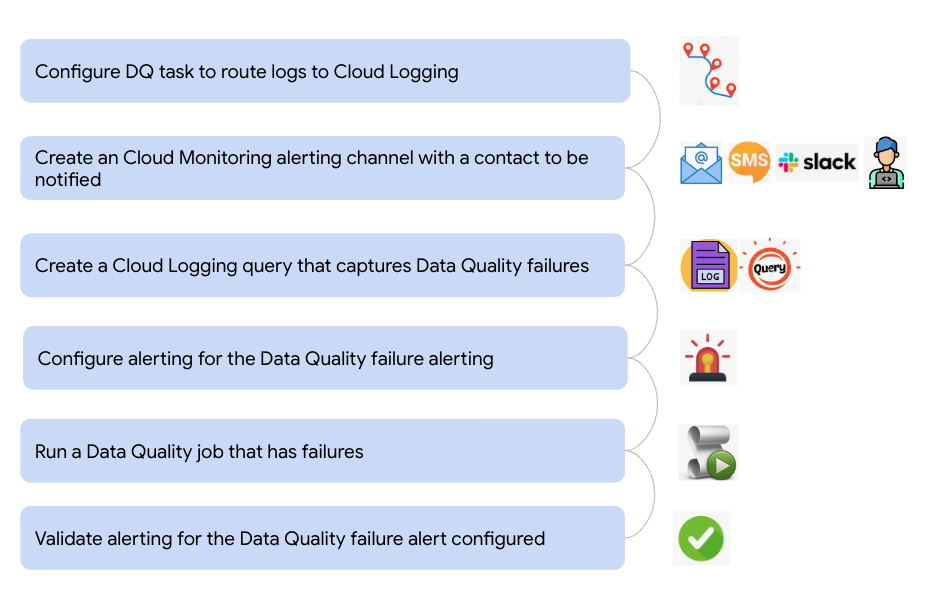   
<br><br>

<hr>

### Lab module prerequisites
Successful completion of prior modules

### Lab module duration
15 minutes or less

### Lab module flow

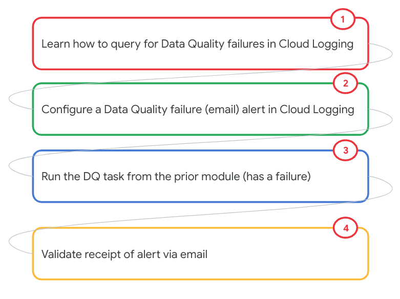   
<br><br>

<hr>
<hr>

# LAB

<hr>

## 1. Route Data Quality summary logs to Cloud Logging

By appending ```, --summary_to_stdout``` flag to your data quality jobs, the Data Quality summary logs get routed to Cloud Logging. In the job we executed in the prior module, we already set the flag, in preparation for this lab module. 

### 1.1 Review the Dataplex Data Quality task command construct and run the same

Study the commands below and run in Cloud Shell-
```
PROJECT_ID=`gcloud config list --format "value(core.project)" 2>/dev/null`
PROJECT_NBR=`gcloud projects describe $PROJECT_ID | grep projectNumber | cut -d':' -f2 |  tr -d "'" | xargs`
UMSA_FQN="lab-sa@${PROJECT_ID}.iam.gserviceaccount.com"
LOCATION="us-central1"
LOCATION_MULTI="US"
LAKE_ID="oda-lake"
DATA_QUALITY_ZONE_ID="oda-dq-zone"
DQ_SCRIPTS_BUCKET="oda-dq-bucket"


PROJECT_ID=`gcloud config list --format "value(core.project)" 2>/dev/null`
PROJECT_NBR=`gcloud projects describe $PROJECT_ID | grep projectNumber | cut -d':' -f2 |  tr -d "'" | xargs`
LOCATION="us-central1"
LOCATION_MULTI="US"
DATA_QUALITY_ZONE_ID="oda-dq-zone"
DQ_SCRIPTS_BUCKET="oda-dq-bucket"

# Public Cloud Storage bucket containing the prebuilt Dataplex data quality executable artifact.
# There is one bucket for each Google Cloud region. DO NOT ALTER THE CONSTRUCT BELOW
DATAPLEX_CLOUD_DQ_GCS_BUCKET_NAME="dataplex-clouddq-artifacts-${LOCATION}"

# Location of user defined DQ YAML Specifications file
DQ_YAML_CONFIG_GCS_PATH="gs://$DQ_SCRIPTS_BUCKET/YAML/customer_master_dq.yaml"

# The Dataplex lake
LAKE_ID="oda-lake"

# The BigQuery dataset where the final results of the data quality checks are stored.
TARGET_BQ_DATASET="oda_dq_scratch_ds"

# The BigQuery table where the final results of the data quality checks are stored.
TARGET_BQ_TABLE="${PROJECT_ID}.${TARGET_BQ_DATASET}.dq_results_customer_master"

# The unique identifier for the DQ task.
DQ_TASK_ID="customer-dq"

# The User Managed Service Account the DQ task will run as 
USER_MANAGED_SERVICE_ACCOUNT_FQN="lab-sa@${PROJECT_ID}.iam.gserviceaccount.com"

gcloud dataplex tasks create \
    --location="${LOCATION}" \
    --lake="${LAKE_ID}" \
    --trigger-type=ON_DEMAND \
    --vpc-sub-network-name="lab-snet" \
    --execution-service-account="$USER_MANAGED_SERVICE_ACCOUNT_FQN" \
    --spark-python-script-file="gs://${DATAPLEX_CLOUD_DQ_GCS_BUCKET_NAME}/clouddq_pyspark_driver.py" \
    --spark-file-uris="gs://${DATAPLEX_CLOUD_DQ_GCS_BUCKET_NAME}/clouddq-executable.zip","gs://${DATAPLEX_CLOUD_DQ_GCS_BUCKET_NAME}/clouddq-executable.zip.hashsum","${DQ_YAML_CONFIG_GCS_PATH}" \
    --execution-args=^::^TASK_ARGS="clouddq-executable.zip, ALL, ${DQ_YAML_CONFIG_GCS_PATH}, --gcp_project_id=${PROJECT_ID}, --gcp_region_id='${LOCATION_MULTI}', --gcp_bq_dataset_id='${TARGET_BQ_DATASET}', --target_bigquery_summary_table='${TARGET_BQ_TABLE}', --summary_to_stdout " \
    "$DQ_TASK_ID-$RANDOM"


```

Note the flag for routing to Cloud Logging.
<br>

<hr>

## 2. Recap of rules we implemented

|#| Dimension | Column | Rule | Is complex rule | Is simple rule |
| --| :-- | :--- | :--- | :--- | :--- |
|1| Completeness |  client_id | Not null |  | x |
|2| Completeness |  client_id | Not blank |  |  x |
|3| Uniqueness |  client_id | No duplicates | x |  |
|4| Conformance |  ssn | Valid format |  | x |
|5| Conformance |  email | Valid format |  | x |
|6| Integrity |  gender | Valid value |  | x |
|7| Correctness |  dob | Valid date in the past |  |  x |
|8| Timeliness |  date | No delay in data arrival | x | |

<br>

<hr>

## 3. Recap of Data Quality results from prior module

Run this query in the BigQuery UI to see the summary results-
```
SELECT * FROM `oda_dq_scratch_ds.dq_summary` 
WHERE complex_rule_validation_errors_count > 0 OR failed_count > 0
```

We should see an error for the rule_id "NO_DATA_DELAY_RULE"-

   
<br><br>

Now that we have an error, we can configure alerting.

<br>


<hr>

## 4. Cloud Logging: Filter for Data Quality issues

### 4.1. Simple rules
Data Quality issues for simple rules can be found with the Cloud Logging filter-

```
jsonPayload.message =~ "failed_count\": [^0|null]" 
```

### 4.2. Complex rules
Data Quality issues for complex rules can be found with the Cloud Logging filter-

```
jsonPayload.message =~ "complex_rule_validation_errors_count\": [^null]"
```
### 4.3. Consolidated quality issue filter we will apply 

jsonPayload.message =~ "complex_rule_validation_errors_count\": [^null]" OR jsonPayload.message =~ "failed_count\": [^0|null]" 

<hr>


## 5. [Lab] Manually filter for Data Quality issues in Cloud Logging

1. Go to Cloud Logging 


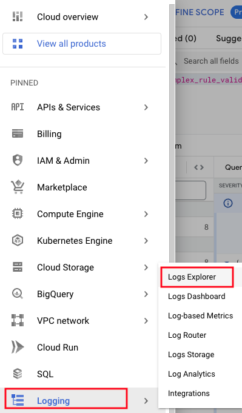   
<br><br>

   
<br><br>


2. Apply the filter and click on "Run Query"

```
jsonPayload.message =~ "complex_rule_validation_errors_count\": [^null]" OR jsonPayload.message =~ "failed_count\": [^0|null]" 
```

You should see a result, like below-
   
<br><br>


3. Expand the query result and study the log

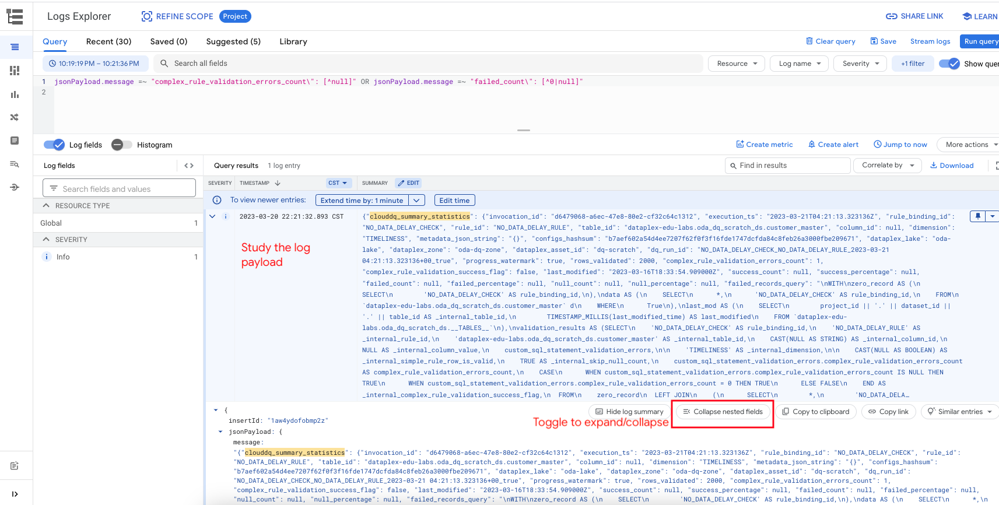   
<br><br>


## 6. [Lab] Configure alerting

Follwing the pictorial instructions below and configure alerting

   
<br><br>

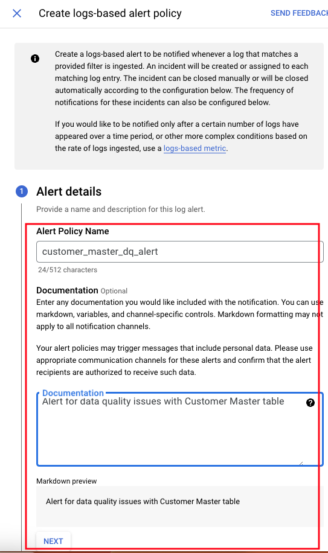   
<br><br>

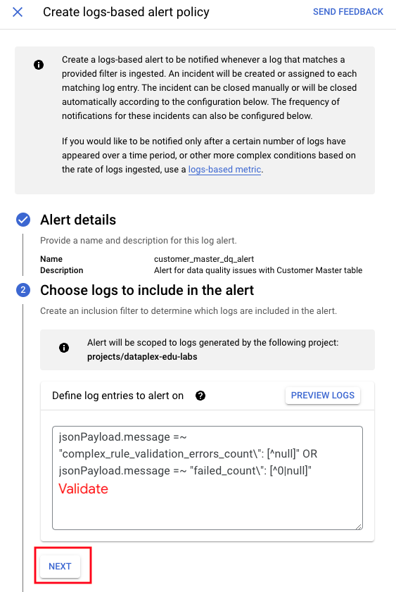   
<br><br>

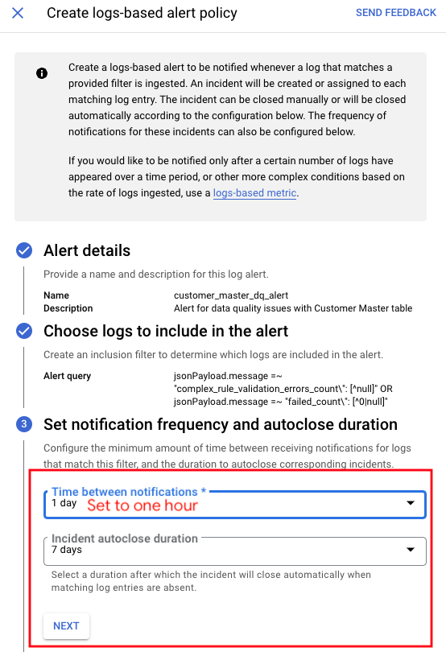   
<br><br>

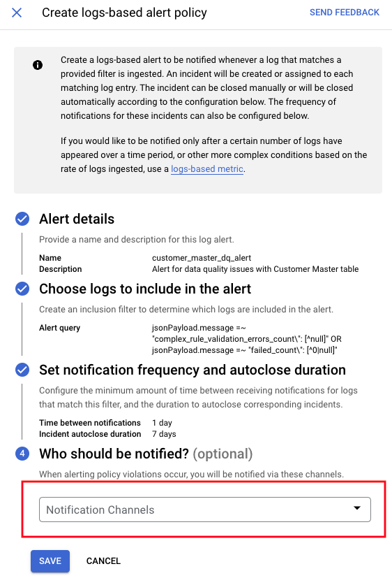   
<br><br>

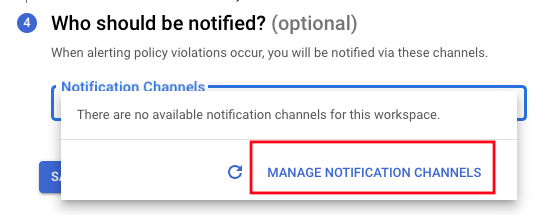   
<br><br>

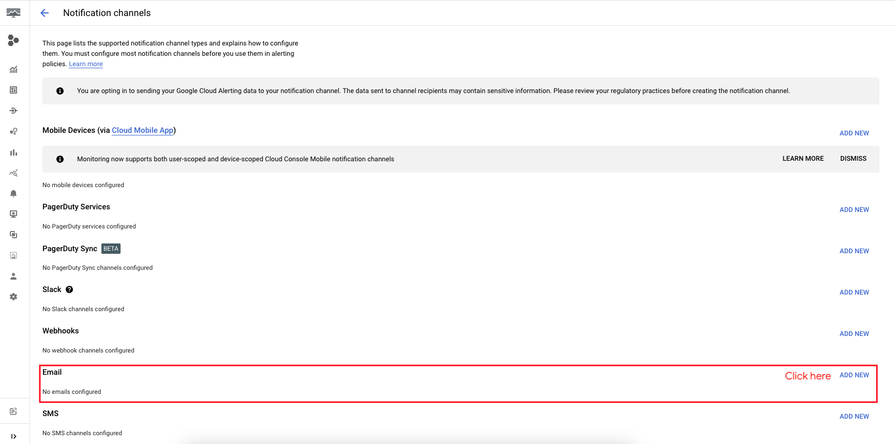   
<br><br>

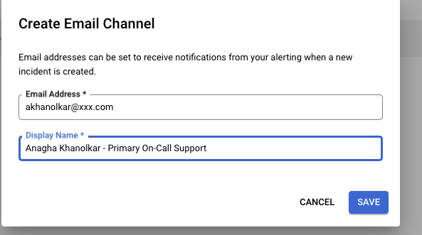   
<br><br>

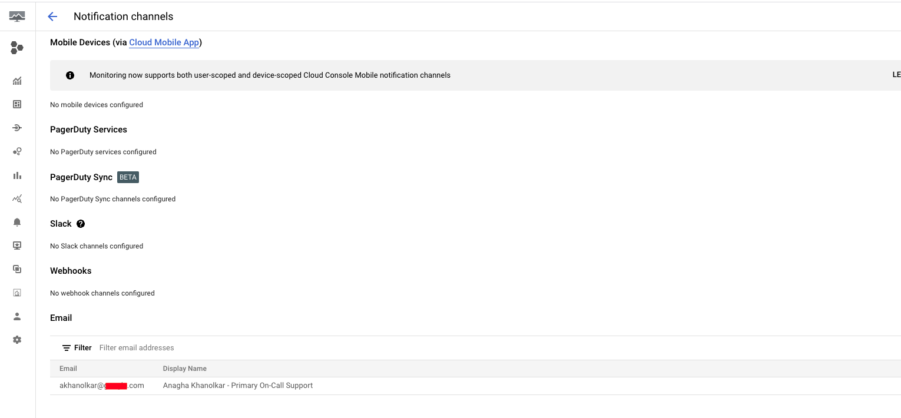   
<br><br>

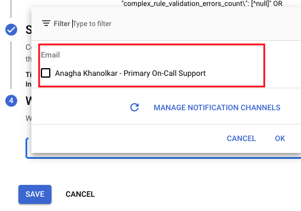   
<br><br>

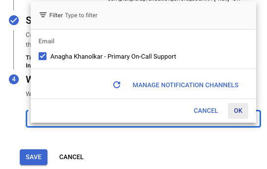   
<br><br>

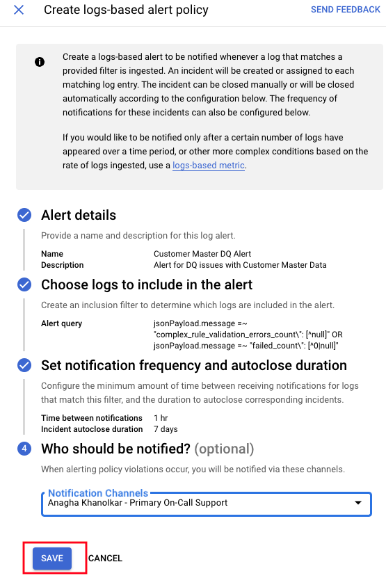   
<br><br>

<hr>

## 7. [Lab] Validate the alerting configuration

Run the Dataplex Data Quality job yet again ([section 1.1 above](module-12-1c-dq-incident-mgmt.md#11-review-the-dataplex-data-quality-task-command-construct-and-run-the-same)) and check your email inbox for a notification. The following is a sample notification.

   
<br><br>

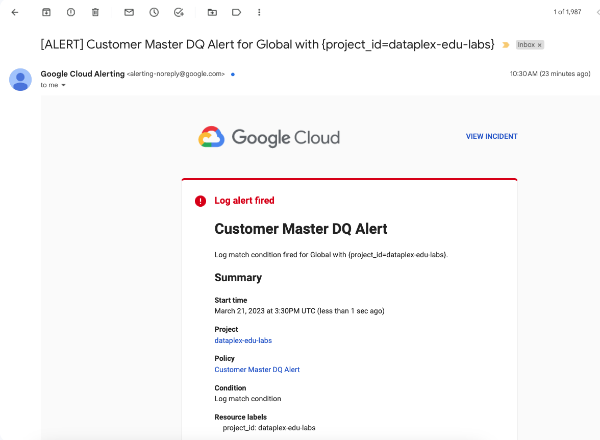   
<br><br>

<hr>

This concludes the lab module. Proceed to the [next module](module-12-1d-dq-task-dq-dashboard.md).

<hr>

