# Operationalizing Data Quality validation for the enterprise

Two modules prior, we learned to run a Data Quality task to populate the Data Quality scores in Dataplex Catalog. In the last module, we learned to automate a Data Quality validation task on the Customer Master Data from Airflow on Cloud Composer. In this module, we will add to the existing Airflow DAG, steps to publish Data Quality scores as tags in the Data Quality pipeline from the prior module. This is representative of the pattern for operationalizing for production.

For Data Quality tagging, we will use a Spark application that we will run via Dataplex tasks.

### End to End Architecture for Data Quality validation

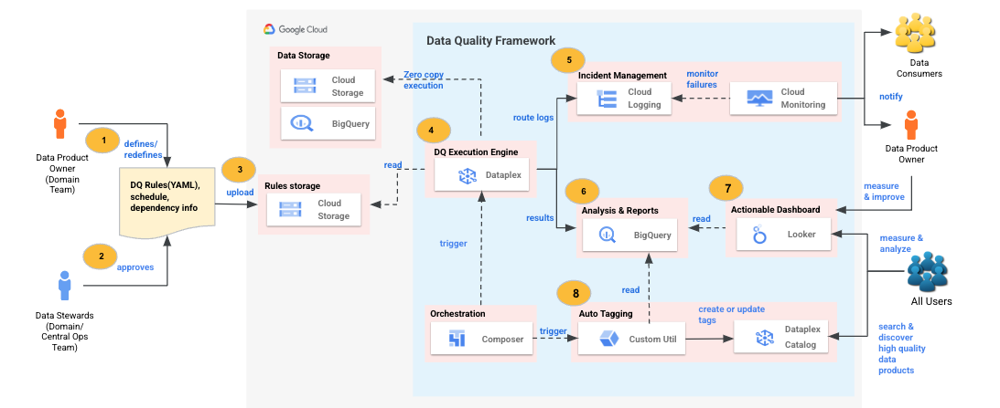   
<br><br>

### Learning goals

We have learned how to author Dataplex DQ YAML, run from command line and automate with Airflow on Cloud Composer. Separately, we learned how to tag Data Quality scores to our Catalog entry. We also learned how to set up incident management for our DQ tasks. In this lab module, we bring it all together and how you how to operationalize Data Quality validation.

### Prerequisites

Successful completion of prior modules

### Duration

15 minutes or less

### Documentation 

[Data Quality Task orchestration with Airflow](https://github.com/GoogleCloudPlatform/cloud-data-quality/blob/main/scripts/dataproc-workflow-composer/clouddq_composer_dataplex_task_job.py)<br>


### Lab flow

   
<br><br>

<hr>
<hr>

## LAB

<hr>

## 1. The Airflow DAG 

This is the DAG we ran in the prior lab module. 

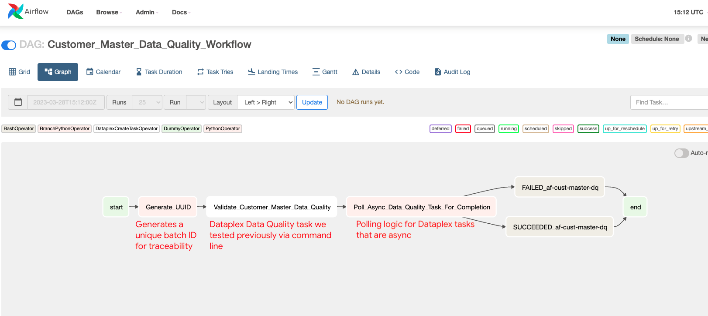   
<br><br>

In this lab module, we will run a DAG that includes additional steps - to push Data Quality scores to Data Catalog DQ tags for our Data Catalog entry for the customer_master table.

   
<br><br>

<hr>

## 2. Review the DAG code

The DAG code is available in your cloud shell already and is called "customer_master_dq_automation_e2e.py". Study how the Data Quality score tagging is a plain Spark application. But still needs polling as Dataplex tasks are async.

```
cat ~/dataplex-quickstart-labs/00-resources/scripts/airflow/data-quality/customer_master_dq_automation_e2e.py
```

<hr>

## 4. Upload the Airflow DAG for Data Quality

Lets upload the DAG to the Cloud Composer DAG bucket. 

```
PROJECT_ID=`gcloud config list --format "value(core.project)" 2>/dev/null`
PROJECT_NBR=`gcloud projects describe $PROJECT_ID | grep projectNumber | cut -d':' -f2 |  tr -d "'" | xargs`
LOCATION="us-central1"

# DAG bucket to upload to
DAG_BUCKET=`gcloud composer environments describe oda-$PROJECT_NBR-cc2 --location $LOCATION | grep dagGcsPrefix: | cut -d' ' -f4`

# Upload the DAG
gsutil cp ~/dataplex-quickstart-labs/00-resources/scripts/airflow/data-quality/customer_master_dq_automation_e2e.py $DAG_BUCKET/data-quality/
```

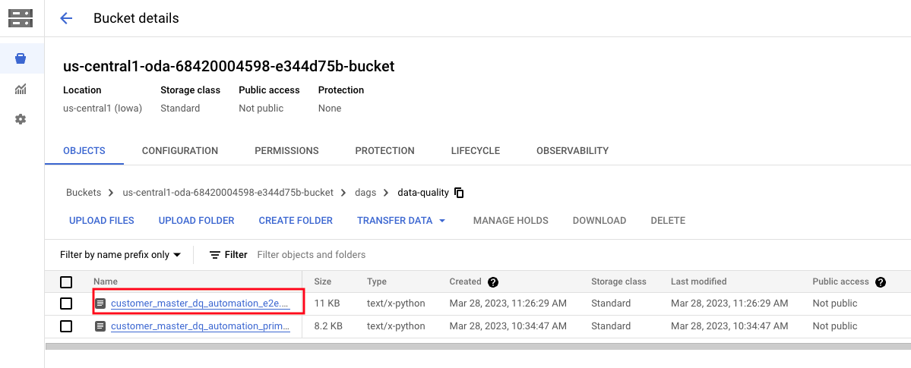   
<br><br>


<hr>

## 5. Run the Data Quality Task from Airflow on Cloud Composer

Follow the screenshots to run the DAG-

   
<br><br>

   
<br><br>


<hr>

## 6. Navigate the DAG execution trail

### 6.1. Dataplex -> Process -> Data Quality

   
<br><br>

### 6.2. Cloud Composer - for the tagging task

   
<br><br>

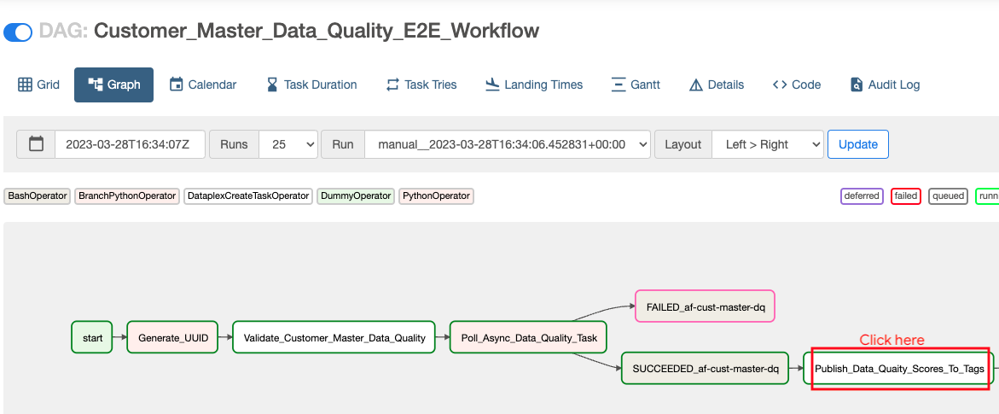   
<br><br>

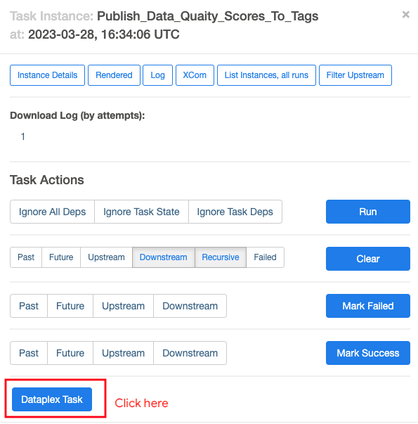   
<br><br>

### 6.3. Dataplex -> Process -> Custom Spark

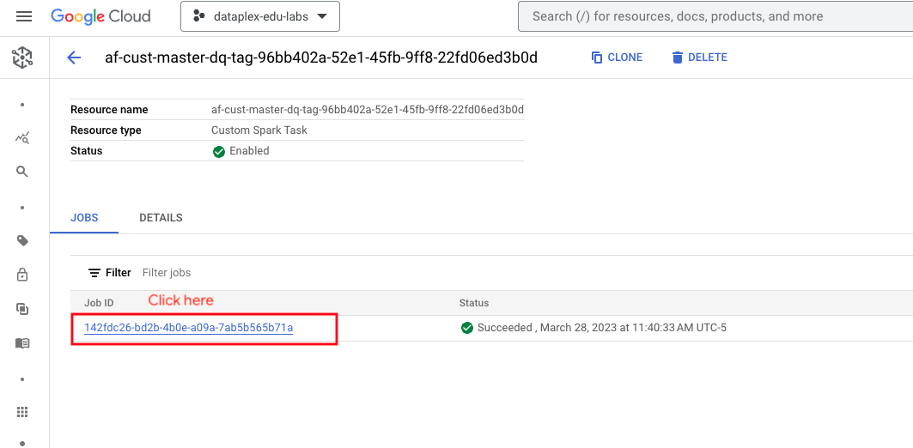   
<br><br>

### 6.4. Dataproc -> Serveress -> Batches

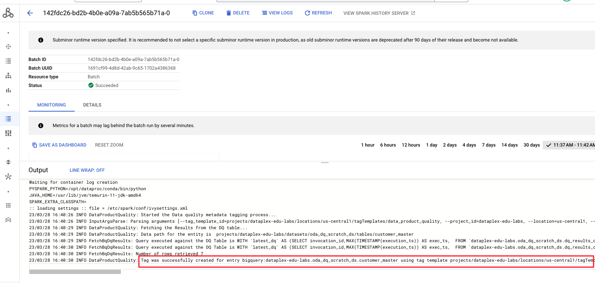   
<br><br>


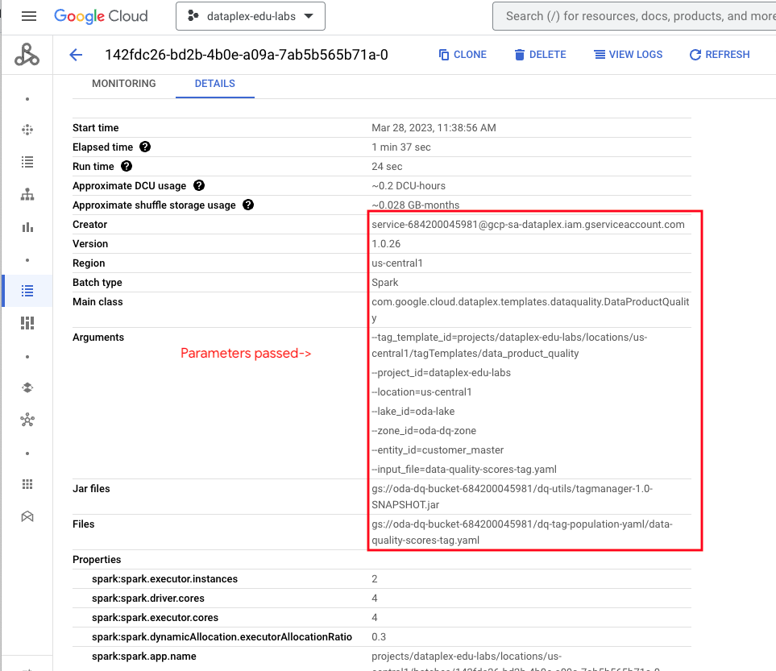   
<br><br>

### 6.5. Cloud Composer - for completion

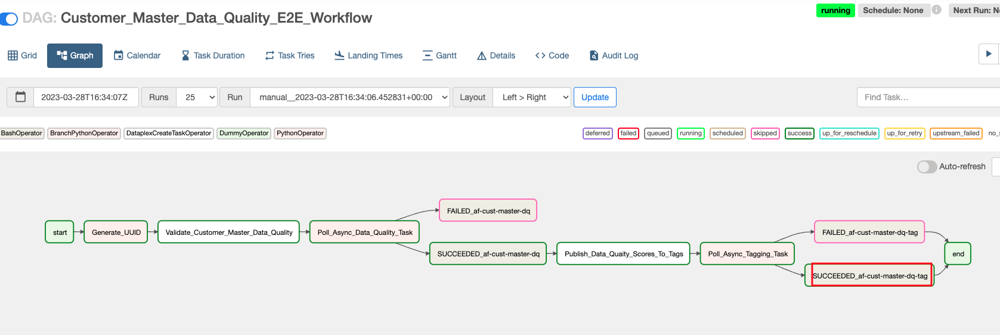   
<br><br>

<hr>


## 7. Review Data Quality scores in Cloud catalog

Search for the customer_master entity and review the Data Quality scores published-

   
<br><br>

   
<br><br>

   
<br><br>

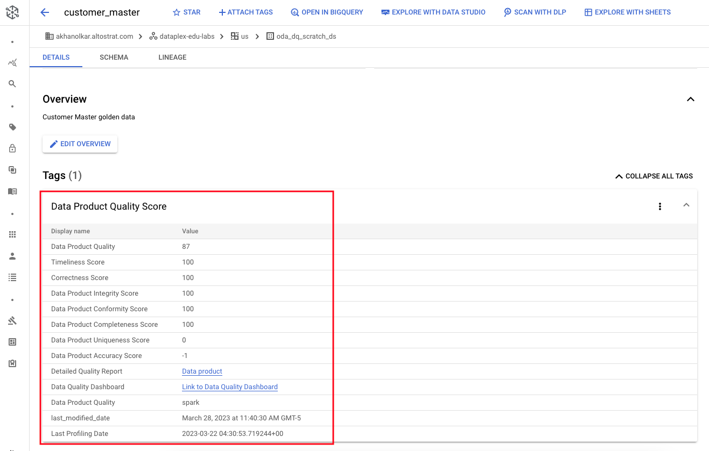   
<br><br>

<hr>

## 8. Review Data Quality dashboard

Click on the dashboard link in the Data Quality tag in Cloud catalog and review the dashboard-

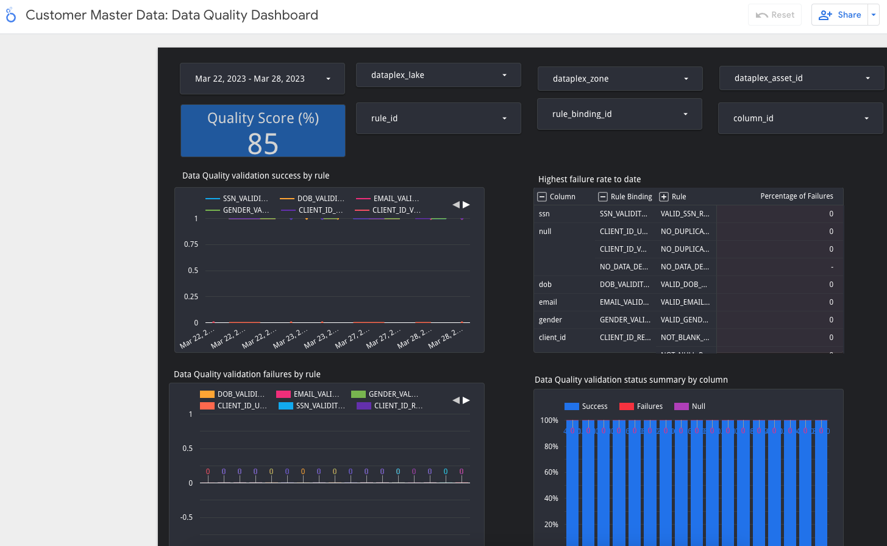   
<br><br>

<hr>


## 9. Review the email alert in your inbox

Expect a delay of a few minutes.

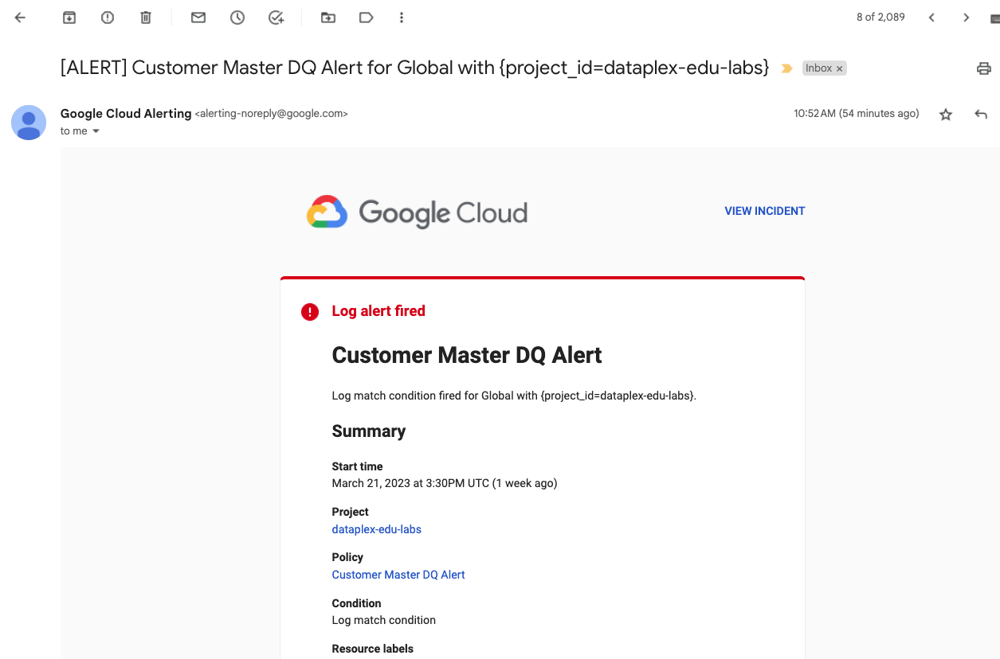   
<br><br>

<hr>


## 10. Acknowledge the incident, fix issue and close incident

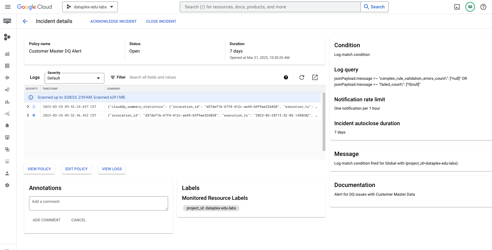   
<br><br>

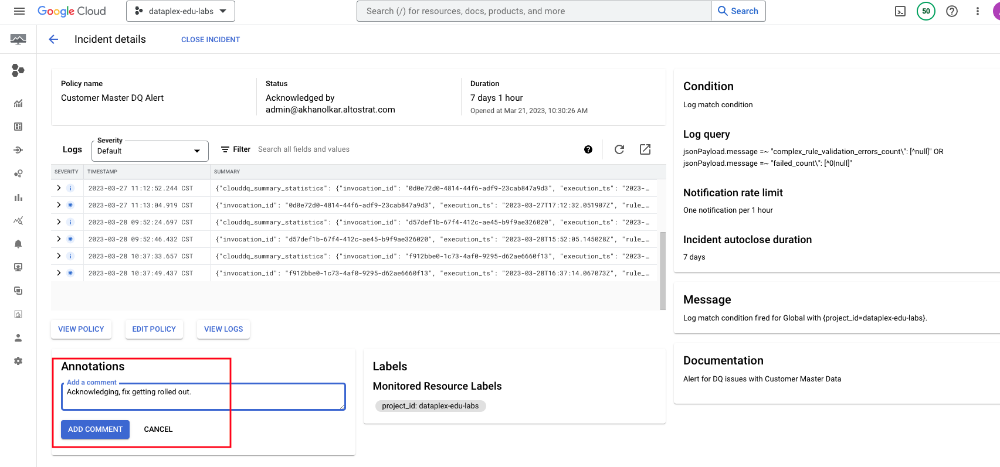   
<br><br>

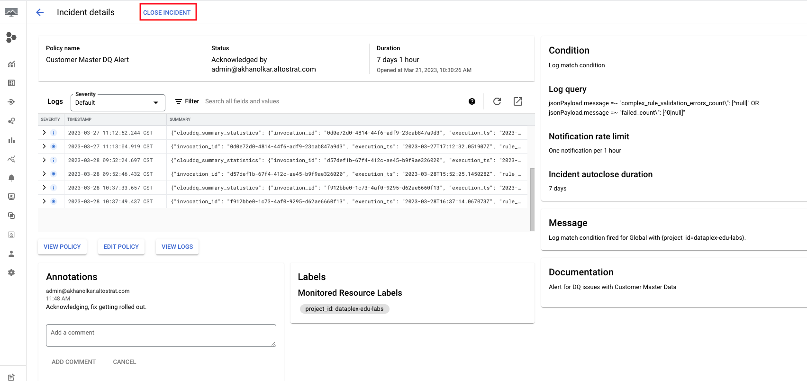   
<br><br>

   
<br><br>

<hr>

This concludes the lab module.

<hr>

